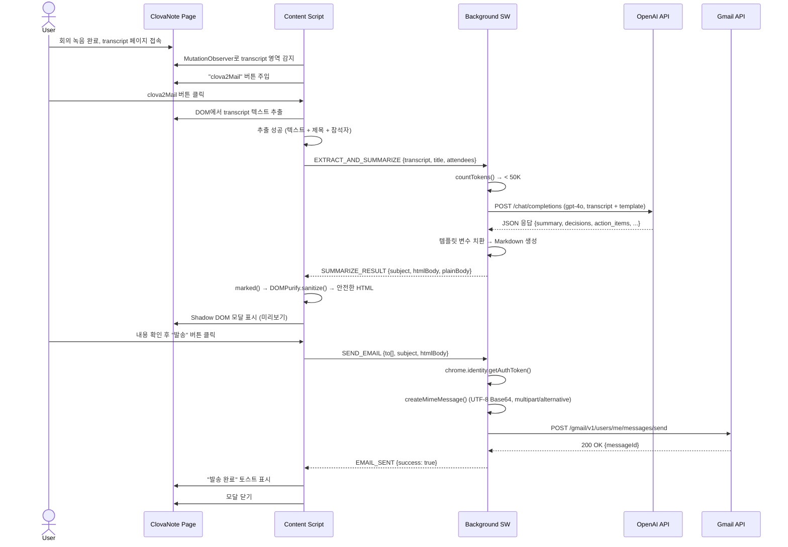
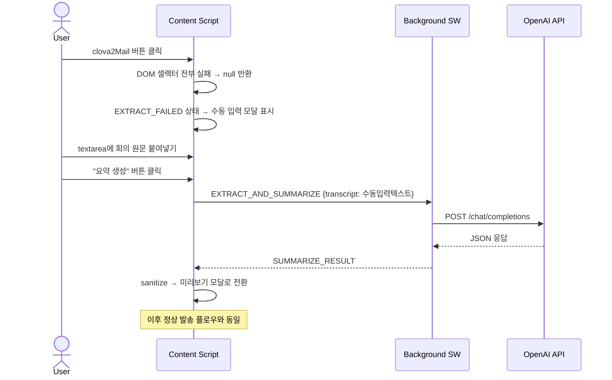
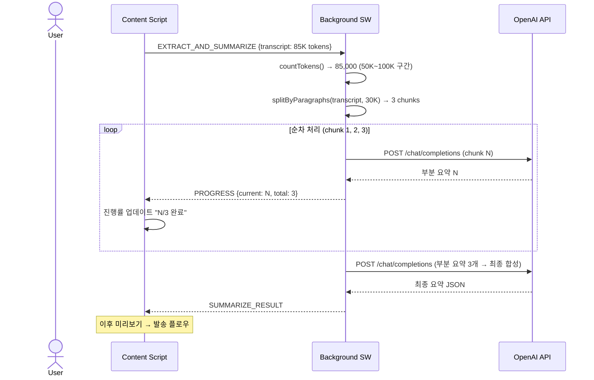
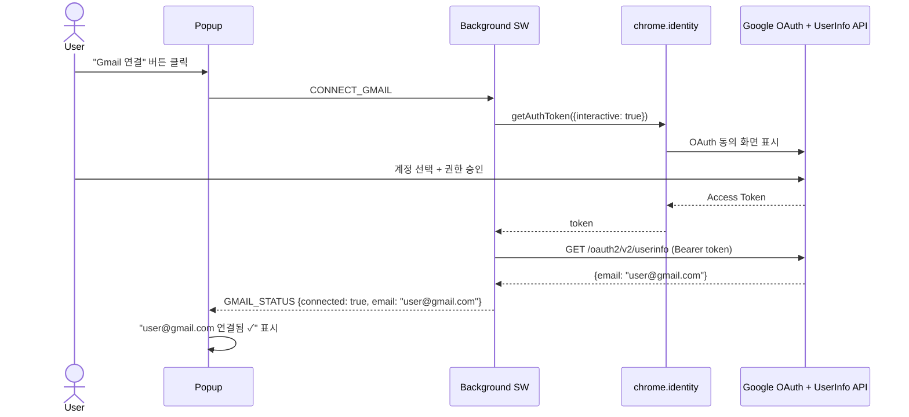

# clova2Mail - 상세 프로젝트 계획서 (PRD)

> 작성일: 2026-03-19
> 버전: v1.2 (Codex 2차 리뷰 반영)
> 상태: 설계 완료, 구현 대기
> 변경 이력:
>   v1.0 → v1.1 OAuth 통일, sanitization 추가, 긴 회의록 전략, MIME 수정, MVP scope 정리, AC 추가
>   v1.1 → v1.2 Gmail email 표시를 위한 userinfo 스코프 추가, chunk 순차처리, 템플릿 raw HTML 금지

---

## 1. 프로젝트 개요

### 1.1 프로젝트명
**clova2Mail** - ClovaNote 회의록 AI 요약 이메일 발송 Chrome Extension

### 1.2 목적
회의 종료 후 ClovaNote에서 생성된 transcript(원문 텍스트)를
사용자가 설정한 이메일 템플릿에 맞게 AI로 요약하고,
지정된 수신자에게 한 번의 클릭으로 이메일을 발송하는 전 과정을 자동화한다.

### 1.3 문제 정의
| AS-IS (현재) | TO-BE (목표) |
|-------------|-------------|
| ClovaNote에서 회의 녹음 | ClovaNote에서 회의 녹음 (동일) |
| transcript 텍스트 복사 | **자동 추출** |
| 수동으로 요약 작성 | **AI가 템플릿에 맞게 자동 요약** |
| 이메일 앱 열고 수신자 입력 | **사전 설정된 수신자 자동 입력** |
| 요약 내용 붙여넣기 후 발송 | **미리보기 확인 후 원클릭 발송** |

### 1.4 핵심 가치
- **시간 절약**: 회의 후 요약 + 발송에 걸리는 10~20분 → 30초
- **일관성**: 매번 동일한 포맷의 깔끔한 회의록 이메일
- **편의성**: ClovaNote 페이지를 벗어나지 않고 모든 작업 완료

### 1.5 MVP Scope 정의

**Phase 1 (MVP)에 포함되는 것**:
- OpenAI API key 기반 요약 (gpt-4o 단일 모델)
- Gmail API 단일 이메일 서비스
- 수신자 목록 관리 (flat list, 그룹 없음)
- 이메일 템플릿 1개 (커스텀 가능)
- ClovaNote DOM에서 transcript 자동 추출
- 미리보기 모달 + 원클릭 발송

**Phase 1에 포함되지 않는 것** (Phase 2 이후):
- Resend, SMTP 등 대체 이메일 서비스
- Claude API, Gemini 등 대체 AI
- 수신자 그룹 관리
- 발송 히스토리
- 요약 수동 편집
- 다국어 지원
- Slack/Teams 연동

---

## 2. 기술 스택 상세

### 2.1 개발 언어 & 런타임

| 구분 | 기술 | 버전 | 선정 이유 |
|------|------|------|----------|
| **언어** | TypeScript | 5.7+ | 타입 안전성, Chrome API 타입 지원 |
| **런타임** | Chrome Extension (Manifest V3) | MV3 | Chrome 최신 표준, MV2는 2024년 폐기 |
| **Node.js** | Node.js | 22 LTS | 빌드 도구 실행용 |
| **패키지 매니저** | pnpm | 9.x | 빠른 설치, 디스크 효율적 |

### 2.2 빌드 & 번들링

| 구분 | 기술 | 버전 | 선정 이유 |
|------|------|------|----------|
| **빌드 도구** | Vite | 6.x | 빠른 HMR, ESM 기반 |
| **Chrome Extension 플러그인** | @crxjs/vite-plugin | 2.x (beta) | Vite + MV3 통합, HMR 지원 |
| **TypeScript 컴파일** | tsc (via Vite) | - | Vite 내장 TS 처리 |

**CRXJS 선정 이유**:
- `manifest.json`을 Vite 설정과 통합하여 빌드 자동화
- Content Script, Background, Popup 각각의 진입점을 자동 처리
- 개발 중 HMR(Hot Module Replacement) 지원으로 빠른 개발 사이클
- 대안인 `vite-plugin-web-extension`보다 React + MV3 조합에서 안정적

### 2.3 UI 프레임워크 & 스타일링

| 구분 | 기술 | 버전 | 적용 범위 | 선정 이유 |
|------|------|------|----------|----------|
| **UI 프레임워크** | React | 19.x | Popup, Modal | 컴포넌트 기반 UI, 생태계 |
| **DOM 렌더링** | ReactDOM | 19.x | Popup, Modal (Shadow DOM) | React → DOM 렌더링 |
| **CSS 프레임워크** | Tailwind CSS | 4.x | 전체 | 유틸리티 퍼스트, 빠른 스타일링 |
| **아이콘** | Lucide React | latest | Popup, Modal | 경량, 트리쉐이킹 가능 |
| **Markdown→HTML** | marked | 15.x | 이메일 본문 변환 | 경량, 커스텀 가능 |
| **HTML Sanitizer** | DOMPurify | 3.x | 모달 미리보기 + 이메일 본문 | XSS 방지 업계 표준 |

**Content Script 모달에서 React 사용 방법**:
```
Content Script → Shadow DOM 생성 → Shadow DOM 내부에 React root mount
→ ClovaNote의 CSS와 완전히 격리된 독립적 React 앱
```

### 2.4 상태 관리

| 구분 | 기술 | 선정 이유 |
|------|------|----------|
| **영구 저장소** | chrome.storage.local | Extension 전용 스토리지, 동기화 불필요 |
| **React 상태** | React 19 내장 (useState, useReducer) | 별도 라이브러리 불필요한 규모 |
| **컴포넌트 간 통신** | chrome.runtime.sendMessage | MV3 표준 메시지 패싱 |

> Zustand, Redux 등 외부 상태 관리 라이브러리는 사용하지 않음.
> Popup과 Modal은 각각 독립된 React 앱이고, 공유 상태는 chrome.storage로 처리.

### 2.5 AI 요약 엔진

| 구분 | 기술 | 상세 | 선정 이유 |
|------|------|------|----------|
| **AI Provider** | OpenAI API | REST API 직접 호출 | Codex/GPT 통합, 사용자 요청 |
| **모델** | gpt-4o | 128K context window | 긴 회의록 처리 가능, 한국어 우수 |
| **SDK** | fetch (직접 호출) | Background Service Worker | SDK 번들 크기 절약, MV3 호환성 |
| **인증** | API Key 방식 | 사용자가 Popup에서 입력 | OAuth 대비 설정 간단 |
| **토큰 카운터** | gpt-tokenizer | 2.x | 사전 토큰 수 계산, 청크 분할 판단 |

**OpenAI SDK를 사용하지 않는 이유**:
- Chrome Extension Background는 Service Worker → Node.js API 사용 불가
- `openai` npm 패키지의 번들 크기가 불필요하게 큼
- fetch 기반 REST 호출이 MV3 Service Worker에서 가장 안정적

**API 호출 스펙**:
```typescript
POST https://api.openai.com/v1/chat/completions
Headers:
  Authorization: Bearer {api_key}
  Content-Type: application/json
Body:
  model: "gpt-4o"
  messages: [
    { role: "system", content: SUMMARIZATION_PROMPT },
    { role: "user", content: transcript + template }
  ]
  temperature: 0.3          // 요약은 일관성이 중요하므로 낮게
  max_tokens: 4096          // 요약 결과물 상한
  response_format: { type: "json_object" }  // 구조화된 응답
```

**응답 JSON 스키마**:
```json
{
  "summary": "회의 전체 요약 (3~5문장)",
  "decisions": ["결정사항 1", "결정사항 2"],
  "action_items": [
    { "task": "태스크 내용", "assignee": "담당자", "deadline": "기한" }
  ],
  "attendees": ["참석자1", "참석자2"],
  "keywords": ["키워드1", "키워드2"]
}
```

### 2.6 이메일 발송 (Gmail API 단일)

> **MVP에서는 Gmail API만 지원합니다. Resend 등 대체 서비스는 Phase 2.**

**Gmail API 선정 이유**:
- 사용자 본인의 Gmail 계정에서 발송 → 수신자가 신뢰
- Chrome Extension의 `chrome.identity` API로 OAuth 토큰 자동 관리
- 일 100통 무료 (회의록 발송 용도로 충분)
- "보낸편지함"에 자동 보관

**Gmail OAuth 플로우 (확정)**:
```
[Popup UI] "Gmail 연결" 버튼 클릭
    → chrome.identity.getAuthToken({ interactive: true })
    → Chrome 내장 Google OAuth 동의 화면
    → Access Token 반환 (Chrome이 캐싱 + 자동 갱신)
    → Gmail API 호출 시 매번 getAuthToken()으로 유효 토큰 획득
```

> **결정 사항**: OAuth 인증은 `chrome.identity.getAuthToken()` 단일 방식으로 통일.
> - `launchWebAuthFlow()` 사용하지 않음 (불필요한 복잡도)
> - `refreshToken`, `expiresAt` 직접 저장하지 않음 (Chrome이 토큰 수명 관리)
> - chrome.storage에 Gmail 관련 토큰을 저장하지 않음
> - 연결 상태 확인: `getAuthToken({ interactive: false })`로 토큰 존재 여부 체크

**필요 OAuth Scopes**:
- `https://www.googleapis.com/auth/gmail.send` (이메일 발송)
- `https://www.googleapis.com/auth/userinfo.email` (연결된 계정 이메일 주소 표시)

> **v1.2 추가**: `userinfo.email` 스코프 추가.
> `gmail.send`만으로는 어떤 계정으로 발송되는지 Popup에 표시할 수 없음.
> `GET https://www.googleapis.com/oauth2/v2/userinfo`로 이메일 주소 1회 조회.
> 민감 스코프가 아니므로 Google OAuth 심사에 부담 없음.

### 2.7 코드 품질 도구

| 구분 | 기술 | 설정 |
|------|------|------|
| **린터** | ESLint | 9.x flat config |
| **포매터** | Prettier | 3.x |
| **타입 체크** | TypeScript strict mode | tsconfig strict: true |
| **테스트** | Vitest | 3.x (유닛 테스트) |
| **E2E 테스트** | Playwright | 1.x (Extension 테스트) |

### 2.8 외부 서비스 의존성 정리 (MVP)

| 서비스 | 용도 | 무료 한도 | 필수 여부 |
|--------|------|----------|----------|
| OpenAI API | 회의록 요약 | $5 크레딧 (신규) | 필수 |
| Google Cloud Console | Gmail OAuth Client ID | 무료 | 필수 |
| Gmail API | 이메일 발송 | 일 100통 | 필수 |

---

## 3. 시스템 아키텍처

### 3.1 전체 구조

```
┌─ Chrome Browser ──────────────────────────────────────────────┐
│                                                                │
│  ┌─ ClovaNote Tab (clovanote.naver.com) ───────────────────┐  │
│  │                                                          │  │
│  │  ┌─────────────────────────────────────────────────┐     │  │
│  │  │  ClovaNote 기존 UI                              │     │  │
│  │  │  ┌─────────────────────────────────────────┐    │     │  │
│  │  │  │  Transcript 영역                        │    │     │  │
│  │  │  │  "안녕하세요, 오늘 회의 시작하겠습니다..."  │    │     │  │
│  │  │  └─────────────────────────────────────────┘    │     │  │
│  │  │  [▶ Play] [📋 Copy] [⬇ Download] [📧 clova2Mail]│     │  │
│  │  └──────────────────────────────────┬──────────────┘     │  │
│  │                                     │ 클릭               │  │
│  │  ┌──────────────────────────────────▼──────────────┐     │  │
│  │  │  [Shadow DOM] 미리보기 모달                      │     │  │
│  │  │  ┌────────────────────────────────────────┐     │     │  │
│  │  │  │ To: kim@co.com, lee@co.com             │     │     │  │
│  │  │  │ Subject: [회의록] 주간 스프린트 미팅      │     │     │  │
│  │  │  │──────────────────────────────────────── │     │     │  │
│  │  │  │ ## 회의 요약                            │     │     │  │
│  │  │  │ 이번 스프린트에서는 ...                   │     │     │  │
│  │  │  │ ## 주요 결정사항                         │     │     │  │
│  │  │  │ 1. API 마이그레이션 다음주 수요일 진행    │     │     │  │
│  │  │  │ ## Action Items                         │     │     │  │
│  │  │  │ - @김 : DB 스키마 설계 (3/22까지)        │     │     │  │
│  │  │  │──────────────────────────────────────── │     │     │  │
│  │  │  │        [취소]  [📧 이메일 발송]           │     │     │  │
│  │  │  └────────────────────────────────────────┘     │     │  │
│  │  └─────────────────────────────────────────────────┘     │  │
│  └──────────────────────────────────────────────────────────┘  │
│                                                                │
│  ┌─ Extension Popup (아이콘 클릭) ──────┐                      │
│  │  [Settings]                          │                      │
│  │  - OpenAI API Key: sk-***           │                      │
│  │  - Gmail: connected ✓              │                      │
│  │  - Recipients: 3명                  │                      │
│  │  - Template: 기본 회의록 양식         │                      │
│  └──────────────────────────────────────┘                      │
│                                                                │
│  ┌─ Background Service Worker ──────────────────────────────┐  │
│  │  chrome.runtime.onMessage.addListener()                   │  │
│  │  - EXTRACT_AND_SUMMARIZE → OpenAI API 호출               │  │
│  │  - SEND_EMAIL → Gmail API 발송                           │  │
│  │  - GET_GMAIL_STATUS → chrome.identity 토큰 체크           │  │
│  └──────────────────────────────────────────────────────────┘  │
└────────────────────────────────────────────────────────────────┘
          │                              │
          ▼                              ▼
   ┌──────────────┐              ┌──────────────┐
   │  OpenAI API  │              │  Gmail API   │
   │  gpt-4o      │              │  v1/send     │
   └──────────────┘              └──────────────┘
```

### 3.2 메인 플로우 시퀀스 다이어그램

#### 정상 플로우 (Short transcript)



#### 추출 실패 → 수동 입력 플로우



#### 긴 회의록 chunk 처리 플로우



#### Gmail OAuth 연결 플로우



### 3.3 컴포넌트 간 통신 상세

```
┌──────────────┐     chrome.runtime      ┌──────────────────┐
│Content Script │ ◄──── sendMessage ────► │ Background Worker │
│              │                          │                  │
│ - DOM 조작    │     Message Types:       │ - API 호출       │
│ - 텍스트 추출 │     ─────────────────    │ - 토큰 관리      │
│ - 모달 렌더링 │     EXTRACT_AND_SUMMARIZE│ - 이메일 발송    │
│              │     SUMMARIZE_RESULT     │                  │
│              │     SEND_EMAIL           │                  │
│              │     EMAIL_SENT           │                  │
└──────────────┘     CHECK_SETTINGS       └──────────────────┘
                     SETTINGS_RESULT              ▲
                                                  │
┌──────────────┐     chrome.storage       ────────┘
│  Popup UI    │ ◄──── local.get/set ────►
│              │
│ - 설정 입력   │     Storage Keys:
│ - API key    │     ─────────────
│ - 수신자 관리 │     openaiApiKey
│ - 템플릿 편집 │     recipients
└──────────────┘     emailTemplate
```

> **Note**: `gmailToken`은 storage에 저장하지 않음. `chrome.identity.getAuthToken()`이 자동 관리.

### 3.3 디렉토리 구조 (MVP)

```
clova2Mail/
├── docs/
│   ├── PRD.md                    # 이 계획서
│   ├── architecture.md           # 아키텍처 설계
│   ├── system_design.md          # 시스템 설계 상세
│   └── task_list.md              # 구현 태스크
│
├── src/
│   ├── background/               # ── Background Service Worker ──
│   │   ├── index.ts              # SW 진입점, 메시지 리스너 등록
│   │   ├── messages.ts           # 메시지 타입별 핸들러 라우팅
│   │   ├── openai.ts             # OpenAI API 클라이언트
│   │   │                         #   - summarizeTranscript()
│   │   │                         #   - buildPrompt()
│   │   │                         #   - parseResponse()
│   │   │                         #   - countTokens()
│   │   │                         #   - chunkAndSummarize()
│   │   └── gmail.ts              # Gmail API 발송 (단일 파일)
│   │                             #   - getGmailToken()
│   │                             #   - sendEmail()
│   │                             #   - createMimeMessage()
│   │                             #   - encodeUtf8Base64()
│   │
│   ├── content/                  # ── Content Script ──
│   │   ├── index.ts              # CS 진입점, observer 시작
│   │   ├── observer.ts           # MutationObserver 관리
│   │   ├── injector.ts           # clova2Mail 버튼 주입
│   │   ├── extractor.ts          # Transcript 텍스트 추출
│   │   ├── sanitizer.ts          # HTML sanitization (DOMPurify 래퍼)
│   │   └── modal/
│   │       ├── index.ts          # Shadow DOM 생성 + React mount
│   │       ├── Modal.tsx         # 모달 컨테이너 컴포넌트
│   │       ├── PreviewEmail.tsx  # 이메일 미리보기 렌더링
│   │       ├── RecipientBar.tsx  # 수신자 태그 표시
│   │       └── modal.css         # 모달 전용 스타일 (Shadow DOM 내부)
│   │
│   ├── popup/                    # ── Popup UI ──
│   │   ├── index.html            # Popup HTML 진입점
│   │   ├── main.tsx              # React root mount
│   │   ├── App.tsx               # Popup 메인 레이아웃
│   │   ├── components/
│   │   │   ├── AuthSection.tsx   # OpenAI API key 입력 + Gmail 연결
│   │   │   ├── RecipientList.tsx # 수신자 CRUD
│   │   │   ├── TemplateEditor.tsx# 이메일 템플릿 편집기
│   │   │   └── StatusBadge.tsx   # 연결 상태 뱃지
│   │   └── hooks/
│   │       ├── useStorage.ts     # chrome.storage 래퍼 훅
│   │       └── useAuth.ts        # 인증 상태 관리 훅
│   │
│   └── shared/                   # ── 공유 모듈 ──
│       ├── types.ts              # 전체 공용 타입 정의
│       ├── constants.ts          # 상수 (API URL, 기본 템플릿 등)
│       ├── storage.ts            # chrome.storage 타입세이프 래퍼
│       └── messages.ts           # 메시지 타입 + 유틸리티
│
├── public/
│   └── icons/
│       ├── icon16.png
│       ├── icon48.png
│       └── icon128.png
│
├── tests/
│   ├── unit/
│   │   ├── openai.test.ts        # 프롬프트 빌드/파싱/청킹 테스트
│   │   ├── extractor.test.ts     # DOM 추출 로직 테스트
│   │   ├── gmail.test.ts         # MIME 메시지 생성 + UTF-8 인코딩 테스트
│   │   ├── sanitizer.test.ts     # HTML sanitization 테스트
│   │   └── storage.test.ts       # 스토리지 래퍼 테스트
│   └── e2e/
│       └── extension.spec.ts     # Playwright Extension 테스트
│
├── manifest.json                 # Chrome Extension Manifest V3
├── vite.config.ts
├── tsconfig.json
├── tailwind.config.ts
├── postcss.config.js
├── .eslintrc.cjs
├── .prettierrc
├── .env.example
├── .gitignore
├── package.json
└── pnpm-lock.yaml
```

---

## 4. 핵심 기능 상세 설계

### 4.1 ClovaNote DOM 버튼 주입

**과제**: ClovaNote는 SPA(React 기반)이므로 페이지 전환 시 DOM이 동적으로 변경됨

**전략**:
```
1. Content Script 로드 시 MutationObserver 시작
2. transcript 영역이 DOM에 나타나면 감지
3. 기존 툴바 버튼 영역(Download 근처) 탐색
4. "clova2Mail" 버튼을 해당 영역에 appendChild
5. 페이지 전환(다른 회의록 클릭) 시 재감지 → 재주입
```

**DOM 셀렉터 전략** (우선순위별 fallback):
```typescript
// 1순위: data 속성 기반 (가장 안정적)
document.querySelector('[data-testid*="download"]')?.parentElement

// 2순위: 클래스명 부분 매칭
document.querySelector('[class*="toolbar"]')
document.querySelector('[class*="action-bar"]')

// 3순위: 텍스트 기반 탐색
Array.from(document.querySelectorAll('button'))
  .find(btn => btn.textContent?.includes('다운로드'))
  ?.parentElement
```

> **중요**: 실제 DOM 셀렉터는 Phase 1 Sprint 1에서 DevTools로 직접 확인 후 확정.
> ClovaNote 업데이트 시 셀렉터가 변경될 수 있으므로 다중 fallback 필수.

### 4.2 Transcript 텍스트 추출

**추출 대상**:
| 데이터 | 추출 위치 | 필수 여부 |
|--------|----------|----------|
| 회의 제목 | 페이지 상단 h1/h2 | 필수 |
| 전체 대화 원문 | transcript 영역 | 필수 |
| 화자 구분 | 각 발화 블록의 이름 | 선택 |
| 타임스탬프 | 각 발화의 시간 | 선택 |
| 참석자 목록 | 사이드바 or 상단 | 선택 |

**추출 결과 포맷**:
```typescript
interface ExtractedData {
  title: string;                    // "주간 스프린트 미팅"
  transcript: string;               // 전체 원문 텍스트
  attendees: string[];              // ["김철수", "이영희"]
  duration?: string;                // "45분"
  date?: string;                    // "2026-03-19"
}
```

**추출 실패 처리 (명시적 실패 surface)**:

> **v1.1 변경**: `document.body.innerText` fallback을 제거합니다.
> 네비게이션, 사이드바, 버튼 텍스트가 혼입되면 요약 품질이 보장 안 됨.

```typescript
function extractTranscript(): ExtractedData | null {
  const selectors = [
    '[class*="transcript"] [class*="text"]',
    '[class*="minute"] [class*="content"]',
    '[class*="record"] [class*="sentence"]',
  ];

  for (const selector of selectors) {
    const elements = document.querySelectorAll(selector);
    if (elements.length > 0) {
      const text = Array.from(elements)
        .map(el => el.textContent?.trim())
        .filter(Boolean)
        .join('\n');

      if (text.length > 50) {  // 최소 길이 검증
        return { title: extractTitle(), transcript: text, attendees: extractAttendees() };
      }
    }
  }

  // 모든 셀렉터 실패 → null 반환, 수동 입력 모달 표시
  return null;
}
```

**실패 시 UX**:
```
┌─────────────────────────────────────────┐
│  clova2Mail                        [✕]  │
├─────────────────────────────────────────┤
│                                         │
│  ⚠️  Transcript를 자동으로 추출하지       │
│  못했습니다. ClovaNote UI가 변경되었을    │
│  수 있습니다.                            │
│                                         │
│  아래에 회의 원문을 직접 붙여넣어 주세요:  │
│  ┌───────────────────────────────────┐  │
│  │                                   │  │
│  │  (textarea - 수동 붙여넣기)        │  │
│  │                                   │  │
│  └───────────────────────────────────┘  │
│                                         │
│  [취소]  [요약 생성]                      │
└─────────────────────────────────────────┘
```

### 4.3 AI 요약 (OpenAI API)

**프롬프트 설계**:

```
[System Prompt]
당신은 기업 회의록 요약 전문가입니다.
사용자가 제공하는 회의 원문(transcript)을 분석하여
주어진 JSON 스키마에 맞게 구조화된 요약을 생성하세요.

규칙:
1. 핵심 내용만 간결하게 요약 (3~5문장)
2. 결정사항은 구체적으로 기술 (누가, 무엇을, 언제)
3. Action Item에는 반드시 담당자와 기한을 명시
4. 불필요한 인사말, 잡담은 제외
5. 한국어로 작성
6. 반드시 JSON 형식으로 응답

[User Message]
## 이메일 템플릿
{사용자가 설정한 템플릿}

## 회의 원문
{추출된 transcript 텍스트}
```

**토큰 사용량 예상**:
| 항목 | 토큰 수 | 비용 (gpt-4o) |
|------|---------|--------------|
| System Prompt | ~200 | - |
| 30분 회의 transcript | ~3,000~5,000 | - |
| 60분 회의 transcript | ~6,000~10,000 | - |
| Input 합계 (60분 기준) | ~10,200 | $0.025 |
| Output (요약 결과) | ~500~1,000 | $0.01 |
| **1회 요약 비용** | - | **약 $0.035 (≈ 50원)** |

#### 4.3.1 긴 회의록 처리 전략

> **v1.1 추가**: transcript 길이에 따른 처리 분기

**토큰 한도 설계**:
| 구간 | transcript 토큰 수 | 처리 방식 | 예상 회의 시간 |
|------|-------------------|----------|--------------|
| Short | ~10,000 이하 | 단일 API 호출 | ~60분 |
| Medium | 10,000~50,000 | 단일 API 호출 (gpt-4o 128K 내) | ~3시간 |
| Long | 50,000~100,000 | chunk-summarize-merge | ~6시간 |
| Overflow | 100,000 초과 | 거부 + 안내 메시지 | ~6시간+ |

**처리 로직**:
```typescript
async function summarizeTranscript(transcript: string, template: string): Promise<SummaryResult> {
  const tokenCount = countTokens(transcript);

  // Case 1: 단일 호출로 처리 가능 (< 50,000 tokens)
  if (tokenCount < 50_000) {
    return await callOpenAI(transcript, template);
  }

  // Case 2: Chunk-Summarize-Merge (50,000 ~ 100,000 tokens)
  // 순차 처리: 병렬(Promise.all)은 낮은 OpenAI 티어에서 429 위험
  if (tokenCount < 100_000) {
    const chunks = splitByParagraphs(transcript, 30_000);  // 30K 토큰 단위로 분할
    const partialSummaries: PartialSummary[] = [];
    for (const [i, chunk] of chunks.entries()) {
      const result = await callOpenAI(chunk, template);
      partialSummaries.push(result);
      onProgress({ current: i + 1, total: chunks.length });  // 진행률 콜백
    }
    return await mergeOpenAI(partialSummaries, template);  // 부분 요약을 최종 합성
  }

  // Case 3: 너무 긴 회의록 → 거부
  throw new TranscriptTooLongError(tokenCount);
}
```

**Chunk 분할 규칙**:
- 화자 발화 블록 단위로 분할 (문장 중간에서 자르지 않음)
- 각 chunk에 회의 제목 + 참석자 정보를 prefix로 포함
- 시간순 보장 (chunk 1 = 회의 앞부분, chunk N = 회의 뒷부분)

> **v1.2 변경**: `Promise.all` 병렬 호출 → `for...of` 순차 처리.
> 이유: 30K 토큰 요청 여러 개를 동시에 보내면 낮은 OpenAI 티어(Free/Tier 1)에서
> RPM 3~5, TPM 40K~60K 제한에 걸려 429 에러 발생 가능.
> 순차 처리하면 진행률 표시도 자연스러움 ("1/3 → 2/3 → 3/3").

**긴 회의록 UX**:
```
┌─────────────────────────────────────────┐
│  ⏳ 긴 회의록을 처리 중입니다...           │
│                                         │
│  📝 약 85,000 토큰 (예상 3시간 분량)      │
│  🔄 3개 구간으로 나누어 요약 중... (2/3)   │
│                                         │
│  [취소]                                  │
└─────────────────────────────────────────┘
```

**100,000 토큰 초과 시**:
```
⚠️ 이 회의록은 너무 길어서 처리할 수 없습니다 (약 120,000 토큰).
6시간 이내의 회의록만 지원됩니다.
회의록의 일부를 선택하여 수동으로 입력해 주세요.
```

### 4.4 HTML Sanitization 설계

> **v1.1 추가**: AI 출력 → HTML 변환 파이프라인과 sanitization 규칙

**전체 렌더링 파이프라인**:
```
[1] 사용자 템플릿 (Markdown only, raw HTML 금지)
    │
    ▼
[2] 템플릿 저장 시 HTML 태그 strip: template.replace(/<[^>]*>/g, '')
    │
    ▼
[3] AI JSON 응답에서 변수 치환 (순수 문자열 치환, HTML 해석 안 함)
    │
    ▼
[4] marked()로 Markdown → HTML 변환
    │
    ▼
[5] DOMPurify.sanitize()로 위험 태그/속성 제거
    │
    ▼
[6] 이메일용 인라인 CSS 주입 (코드에서 프로그래밍 방식으로)
    │
    ├──► 모달 미리보기 (Shadow DOM 내 innerHTML)
    └──► 이메일 본문 (Gmail API)
```

> **v1.2 변경**: 파이프라인에 [2] 템플릿 HTML strip + [6] 인라인 CSS 주입 단계 추가.

**DOMPurify 설정 (허용 화이트리스트)**:
```typescript
const SANITIZE_CONFIG = {
  ALLOWED_TAGS: [
    'h1', 'h2', 'h3', 'h4',
    'p', 'br', 'hr',
    'ul', 'ol', 'li',
    'strong', 'em', 'b', 'i',
    'table', 'thead', 'tbody', 'tr', 'th', 'td',
    'blockquote', 'code', 'pre',
    'span', 'div',
  ],
  ALLOWED_ATTR: [],               // style 포함 모든 속성 금지
  FORBID_TAGS: [
    'script', 'iframe', 'object', 'embed', 'form', 'input',
    'textarea', 'select', 'button', 'a', 'img',
  ],
  FORBID_ATTR: [
    'onerror', 'onload', 'onclick', 'onmouseover',
    'href', 'src', 'action',
    'style',                       // 인라인 CSS도 금지 (코드에서 주입하는 것만 허용)
  ],
};
```

> **v1.2 변경**: `ALLOWED_ATTR`에서 `style` 제거.
> 사용자/AI 입력에서 오는 인라인 CSS는 레이아웃을 깨뜨릴 수 있음.
> 이메일용 인라인 CSS는 sanitize 이후에 코드에서 프로그래밍 방식으로 주입.

**템플릿 raw HTML 금지 정책**:
```typescript
/**
 * 템플릿 저장 시 raw HTML 태그를 strip.
 * Markdown 문법만 허용 (##, **, -, 1. 등).
 */
function stripHtmlFromTemplate(template: string): string {
  return template.replace(/<[^>]*>/g, '');
}
```

> Popup 템플릿 편집기에 안내 텍스트 표시:
> "Markdown 문법을 사용하세요 (## 제목, **굵게**, - 목록). HTML 태그는 자동 제거됩니다."

**적용 위치**:
| 위치 | 입력 | 처리 | 비고 |
|------|------|------|------|
| 템플릿 저장 | 사용자 템플릿 | `stripHtmlFromTemplate()` | raw HTML strip |
| 모달 미리보기 | AI 요약 HTML | `DOMPurify.sanitize(html, config)` | Shadow DOM 내부 |
| 이메일 본문 | sanitized HTML | `injectEmailStyles(html)` | 코드에서 인라인 CSS 주입 |
| 변수 치환 | AI JSON 값 | 순수 문자열 치환 (HTML 해석 안 함) | XSS 원천 차단 |

### 4.5 이메일 템플릿 시스템

**기본 제공 템플릿**:
```markdown
제목: [회의록] {title} - {date}

{summary}

---

## 주요 결정사항
{decisions}

## Action Items
{action_items}

## 참석자
{attendees}

---
본 메일은 clova2Mail에 의해 자동 생성되었습니다.
```

**템플릿 변수 목록**:
| 변수 | 설명 | 예시 |
|------|------|------|
| `{title}` | 회의 제목 | 주간 스프린트 미팅 |
| `{date}` | 회의 날짜 | 2026-03-19 |
| `{summary}` | AI 요약 | 이번 스프린트에서는... |
| `{decisions}` | 결정사항 목록 | 1. API 마이그레이션... |
| `{action_items}` | 할일 목록 | - @김철수: DB 설계... |
| `{attendees}` | 참석자 | 김철수, 이영희, 박지성 |
| `{keywords}` | 핵심 키워드 | API, 마이그레이션, DB |

### 4.6 이메일 발송 (Gmail API) - MIME 인코딩 수정

> **v1.1 변경**: 한국어 안전한 UTF-8 Base64 인코딩으로 교체

**UTF-8 안전 Base64 인코딩**:
```typescript
/**
 * btoa()는 Latin-1만 지원하므로 한국어가 깨짐.
 * TextEncoder로 UTF-8 바이트 배열 → Base64 변환.
 */
function utf8ToBase64(str: string): string {
  const encoder = new TextEncoder();
  const bytes = encoder.encode(str);
  const binString = Array.from(bytes, (byte) => String.fromCodePoint(byte)).join('');
  return btoa(binString);
}

/**
 * Gmail API용 URL-safe Base64
 */
function utf8ToBase64Url(str: string): string {
  return utf8ToBase64(str)
    .replace(/\+/g, '-')
    .replace(/\//g, '_')
    .replace(/=+$/, '');
}
```

**MIME 메시지 구성 (multipart/alternative)**:
```typescript
function createMimeMessage(to: string[], subject: string, htmlBody: string): string {
  const boundary = `boundary_${crypto.randomUUID()}`;
  const plainBody = htmlToPlainText(htmlBody);  // HTML → 텍스트 변환

  // Subject: RFC 2047 B-encoding (UTF-8 안전)
  const encodedSubject = `=?UTF-8?B?${utf8ToBase64(subject)}?=`;

  return [
    `To: ${to.join(', ')}`,
    `Subject: ${encodedSubject}`,
    'MIME-Version: 1.0',
    `Content-Type: multipart/alternative; boundary="${boundary}"`,
    '',
    `--${boundary}`,
    'Content-Type: text/plain; charset=UTF-8',
    'Content-Transfer-Encoding: base64',
    '',
    utf8ToBase64(plainBody),
    '',
    `--${boundary}`,
    'Content-Type: text/html; charset=UTF-8',
    'Content-Transfer-Encoding: base64',
    '',
    utf8ToBase64(htmlBody),
    '',
    `--${boundary}--`,
  ].join('\r\n');
}
```

**핵심 변경점 (v1.0 대비)**:
| 항목 | v1.0 (문제) | v1.1 (수정) |
|------|------------|------------|
| Subject 인코딩 | `btoa(subject)` - 한국어 깨짐 | `utf8ToBase64()` - UTF-8 안전 |
| Content-Type | `text/html` 단일 | `multipart/alternative` (plain + html) |
| Body 인코딩 | 인코딩 없음 | `Content-Transfer-Encoding: base64` |
| Base64 함수 | `btoa()` 직접 사용 | `TextEncoder` + `btoa()` 조합 |

**HTML 이메일 스타일링**:
- 인라인 CSS (이메일 클라이언트 호환)
- 반응형 최소 지원 (max-width: 600px)
- 깔끔한 타이포그래피 (시스템 폰트)
- 섹션별 구분선

### 4.7 미리보기 모달

**모달 상태 머신**:
```
IDLE → EXTRACTING → LOADING → PREVIEW → SENDING → SENT
  │       │            │         │         │        │
  │       ▼            ▼         │         ▼        ▼
  │  EXTRACT_FAILED  ERROR ←────┘      ERROR    (닫기)
  │       │            │
  │       ▼            └───────── (재시도)
  │  MANUAL_INPUT
  │       │
  └───────┘
```

> **v1.1 변경**: `EXTRACT_FAILED` → `MANUAL_INPUT` 상태 추가

---

## 5. 보안 설계

### 5.1 API Key 보호

| 위협 | 대응 |
|------|------|
| API Key 노출 | chrome.storage.local은 Extension 프로세스만 접근 가능 |
| Content Script에서 key 접근 | Background에서만 API 호출, key를 Content Script에 전달하지 않음 |
| 소스코드에 key 하드코딩 | .env + .gitignore, 사용자가 직접 입력 |

### 5.2 Content Script 보안

| 위협 | 대응 |
|------|------|
| XSS via AI output | DOMPurify sanitize (허용 태그 화이트리스트) |
| XSS via transcript | 템플릿 변수는 textContent 기반 치환, HTML 해석 안 함 |
| CSS 충돌 | Shadow DOM (closed mode) 사용 |
| ClovaNote 페이지 변조 | Content Script는 읽기 전용, DOM 수정은 버튼/모달만 |
| dangerouslySetInnerHTML | **사용 금지**. sanitize된 HTML만 Shadow DOM의 innerHTML에 사용 |

### 5.3 OAuth 보안

| 위협 | 대응 |
|------|------|
| 토큰 탈취 | chrome.identity API가 자동 관리 (Extension 프로세스 격리) |
| Scope 과다 요청 | gmail.send + userinfo.email만 요청 (메일 읽기 권한 없음) |
| 토큰 만료 | chrome.identity.getAuthToken()이 자동 갱신 |
| 토큰 직접 저장 | **하지 않음**. chrome.identity가 전담 관리 |

### 5.4 개인정보 보호 정책

| 항목 | 정책 |
|------|------|
| Transcript 데이터 | Extension 메모리에서만 처리, 어디에도 영구 저장하지 않음 |
| 요약 결과 | 이메일 발송 후 메모리에서 삭제, chrome.storage에 저장하지 않음 |
| 수신자 이메일 | chrome.storage.local에 저장 (사용자 기기 내) |
| OpenAI API 전송 | 사용자가 API key를 직접 관리, 데이터는 OpenAI 이용약관에 따름 |
| 외부 서버 | **자체 서버 없음**. 모든 데이터는 사용자 브라우저 ↔ API 직접 통신 |

---

## 6. 구현 일정 (Phase 1 MVP)

### Sprint 1: 기반 + Content Script (Week 1)

| # | 태스크 | 상세 | 산출물 |
|---|--------|------|--------|
| 1-1 | 프로젝트 셋업 | pnpm init, Vite+CRXJS+React+TS, Tailwind, ESLint/Prettier | 빌드 가능한 빈 Extension |
| 1-2 | Manifest V3 작성 | permissions, host_permissions, content_scripts, background, action | manifest.json |
| 1-3 | ClovaNote DOM 분석 | DevTools로 실제 셀렉터 확인 및 문서화 | DOM 셀렉터 맵 |
| 1-4 | MutationObserver 구현 | transcript 페이지 감지 + 페이지 전환 처리 | observer.ts |
| 1-5 | 버튼 주입 구현 | clova2Mail 버튼 생성 + 툴바에 삽입 | injector.ts |
| 1-6 | Transcript 추출 구현 | 제목/원문/참석자 추출, 실패 시 null 반환 | extractor.ts |

### Sprint 2: Popup + AI 연동 (Week 2)

| # | 태스크 | 상세 | 산출물 |
|---|--------|------|--------|
| 2-1 | Popup 기본 레이아웃 | React + Tailwind, 탭/섹션 구조 | App.tsx |
| 2-2 | API Key 입력 UI | 입력, 검증, 저장, 상태 표시 | AuthSection.tsx |
| 2-3 | 수신자 관리 UI | 이메일 추가/삭제, 검증 | RecipientList.tsx |
| 2-4 | 템플릿 편집기 UI | textarea 기반 편집, 변수 삽입 가이드 | TemplateEditor.tsx |
| 2-5 | chrome.storage 래퍼 | 타입세이프 get/set/watch | storage.ts |
| 2-6 | OpenAI API 클라이언트 | 프롬프트 빌드, 토큰 카운트, 청킹, API 호출, 응답 파싱 | openai.ts |
| 2-7 | 메시지 핸들러 | Content Script ↔ Background 통신 | messages.ts |

### Sprint 3: 모달 + 이메일 발송 (Week 3)

| # | 태스크 | 상세 | 산출물 |
|---|--------|------|--------|
| 3-1 | Shadow DOM 기반 모달 | React root in Shadow DOM | modal/index.ts |
| 3-2 | HTML Sanitizer | DOMPurify 래퍼 + 화이트리스트 설정 | sanitizer.ts |
| 3-3 | 미리보기 컴포넌트 | Markdown→HTML→Sanitize→렌더링, 상태 머신 | PreviewEmail.tsx |
| 3-4 | 추출 실패 UI | 수동 붙여넣기 textarea, MANUAL_INPUT 상태 | Modal.tsx |
| 3-5 | Gmail OAuth 연동 | chrome.identity.getAuthToken() 단일 방식 | gmail.ts (auth) |
| 3-6 | Gmail 발송 구현 | UTF-8 MIME 생성, multipart/alternative, API 호출 | gmail.ts (send) |

### Sprint 4: 테스트 + 마무리 (Week 4)

| # | 태스크 | 상세 | 산출물 |
|---|--------|------|--------|
| 4-1 | 유닛 테스트 | openai, extractor, gmail (MIME 한국어), sanitizer | tests/unit/ |
| 4-2 | E2E 테스트 | Playwright로 Extension 통합 테스트 | tests/e2e/ |
| 4-3 | 에러 상태 UI | API 키 없음, 추출 실패, 토큰 초과 등 | 각 컴포넌트 에러 상태 |
| 4-4 | 아이콘 디자인 | 16/48/128px PNG | public/icons/ |
| 4-5 | 최종 QA | 실제 ClovaNote에서 전체 플로우 테스트 | - |

---

## 7. 리스크 & 대응 방안

| 리스크 | 확률 | 영향도 | 대응 방안 |
|--------|------|--------|----------|
| ClovaNote DOM 구조 변경 | 높음 | 높음 | 다중 셀렉터 fallback + 수동 텍스트 입력 옵션 (body fallback 제거) |
| 긴 회의록 비용 폭발 | 중간 | 중간 | 토큰 사전 카운트 + 100K 초과 거부 + chunk 비용 경고 UI |
| Gmail OAuth 심사 | 중간 | 중간 | 개인 사용은 심사 불필요, 배포 시 제한된 사용자 등록 |
| MIME 한국어 깨짐 | 높음 | 높음 | UTF-8 Base64 인코딩 + multipart/alternative (유닛 테스트 필수) |
| AI 출력 XSS | 낮음 | 높음 | DOMPurify 화이트리스트 + Shadow DOM 격리 |
| OpenAI API 비용 증가 | 낮음 | 중간 | 1회당 ~50원, gpt-4o-mini 대체 옵션 준비 |
| ClovaNote CSP 제한 | 낮음 | 높음 | Content Script는 CSP 영향 안 받음 (Extension 권한) |

---

## 8. 향후 확장 (Phase 2~3)

### Phase 2: Enhancement
- **Resend 이메일 옵션**: Gmail 외 대안 (이메일 서비스 추상화 레이어 추가)
- **발송 히스토리**: 과거 발송 내역 조회
- **요약 수동 편집**: 모달 내 직접 수정
- **수신자 그룹**: "개발팀", "기획팀" 등 그룹화
- **다국어 요약**: 한/영/일 자동 선택

### Phase 3: Advanced
- **Claude API 연동**: OpenAI 외 AI 옵션
- **Slack/Teams 연동**: 이메일 외 메신저로 발송
- **정기 회의 자동 감지**: 같은 이름의 회의 자동 수신자 매핑
- **요약 품질 피드백**: 사용자 평가 기반 프롬프트 개선
- **Chrome Web Store 배포**: 공개 배포

---

## 9. Acceptance Criteria (완료 기준)

### 9.1 기능별 Pass/Fail 조건

#### AC-1: 버튼 주입
| 조건 | Pass | Fail |
|------|------|------|
| ClovaNote transcript 페이지 접속 | 5초 이내 "clova2Mail" 버튼 표시 | 버튼 미표시 |
| SPA 페이지 전환 (다른 회의록 클릭) | 전환 후 3초 이내 버튼 재표시 | 이전 버튼 잔존 또는 미표시 |
| 중복 주입 방지 | 항상 버튼 1개만 존재 | 2개 이상 표시 |
| ClovaNote 기능 영향 | 기존 버튼 (재생, 복사, 다운로드) 정상 동작 | 기존 기능 깨짐 |

#### AC-2: Transcript 추출
| 조건 | Pass | Fail |
|------|------|------|
| 정상 추출 | 회의 제목 + 원문 텍스트 반환, 네비게이션/사이드바 텍스트 미포함 | 관련 없는 텍스트 혼입 |
| 추출 실패 | null 반환 + "수동 입력" 모달 표시 | 빈 문자열로 요약 시도 |
| 빈 transcript | "내용이 없습니다" 에러 표시 | 빈 내용으로 API 호출 |

#### AC-3: AI 요약
| 조건 | Pass | Fail |
|------|------|------|
| 30분 회의 (5K tokens) | 10초 이내 요약 완료 | 30초 초과 또는 타임아웃 |
| 3시간 회의 (50K tokens) | chunk 처리 + 진행률 표시 | 무응답 또는 에러 없이 실패 |
| 6시간+ 회의 (100K+ tokens) | 명확한 거부 메시지 + 수동 입력 유도 | 조용히 실패 |
| API key 미설정 | "설정에서 API key를 입력하세요" 안내 | 빈 에러 |
| API 호출 실패 (429, 500) | 에러 메시지 + 재시도 버튼 | 무한 로딩 |
| JSON 응답 파싱 실패 | "요약 형식 오류" + 재시도 | 모달 깨짐 |

#### AC-4: 이메일 발송
| 조건 | Pass | Fail |
|------|------|------|
| 한국어 제목 | 수신자 이메일 클라이언트에서 제목 정상 표시 | 깨진 문자 표시 |
| 한국어 본문 | HTML/텍스트 본문 모두 정상 | 깨진 문자 또는 인코딩 오류 |
| 수신자 3명 발송 | 3명 모두 수신 확인 | 일부 누락 |
| Gmail 미연결 | "Gmail을 연결하세요" 안내 | 빈 에러 |
| Gmail 토큰 만료 | 자동 갱신 후 발송 | 재로그인 필요 시 명확한 안내 |
| 발송 성공 | "발송 완료" 토스트 + 모달 닫기 | 완료 여부 불명확 |

#### AC-5: HTML Sanitization
| 조건 | Pass | Fail |
|------|------|------|
| AI가 `<script>` 포함 응답 | script 태그 제거 후 렌더링 | script 실행 |
| AI가 `<a href>` 포함 응답 | 링크 제거, 텍스트만 표시 | 클릭 가능한 링크 렌더링 |
| AI가 `` 포함 | 이벤트 핸들러 제거 | JS 실행 |
| 정상 Markdown (h2, ul, li) | HTML 변환 후 정상 렌더링 | 태그 깨짐 |

### 9.2 미지원 케이스 (Explicitly Out of Scope)

| 케이스 | 대응 |
|--------|------|
| ClovaNote 앱 (iOS/Android) | 미지원, Chrome Extension만 |
| Firefox, Safari, Edge | Chrome만 지원 (MVP) |
| 6시간 초과 회의록 | 거부 + 수동 입력 안내 |
| 이미지/파일 첨부 | 미지원, 텍스트만 |
| 회의 중 실시간 요약 | 미지원, 완료된 transcript만 |
| 다중 언어 혼용 회의 | 미지원, 한국어 우선 (영어 혼용은 부분 지원) |
| ClovaNote 로그인 미완료 상태 | 미지원, 로그인 된 상태에서만 동작 |

### 9.3 성능 기준

| 기준 | 목표 | 측정 방법 |
|------|------|----------|
| 버튼 주입 시간 | 5초 이내 | timestamp 로그 |
| 요약 생성 시간 (30분 회의) | 10초 이내 | API 응답 시간 |
| 요약 생성 시간 (3시간 회의) | 60초 이내 | chunk 처리 총 시간 |
| 이메일 발송 시간 | 3초 이내 | Gmail API 응답 시간 |
| 전체 플로우 | 버튼 클릭 → 발송 완료 30초 이내 (30분 회의 기준) | E2E 타이머 |
| Extension 메모리 사용 | 50MB 이하 | Chrome DevTools |
